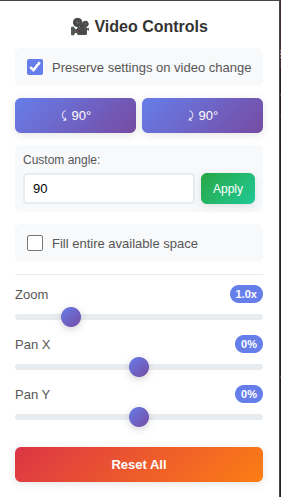

# YouTube Video Controls Extension

A powerful browser extension that adds basic video manipulation controls to YouTube, allowing you to rotate, zoom, and pan videos with precision.

  

### **Settings Persistence**

- **Preserve settings toggle** - Choose whether video transformations carry over to new videos
- **Smart storage system** - Settings automatically saved and restored when enabled

### **Smart Reset**

- **One-click reset** that restores video to original state
- **Clears all transformations** and returns video to natural position
- **Preserves original YouTube styling**

## 🚀 Installation

Install from Chrome Web Store: [WIP - Link to be added])

## 📄 Privacy Policy

This extension does not collect any personal data. All transformations are performed locally in your browser without sending any information to external servers.

Source code is available on [GitHub](https://github.com/kavehtehrani/youtube-video-controls)

## 📄 License

This project is open source and available under the MIT License.

## 🤝 Contributing

Contributions, issues, and feature requests are welcome! Feel free to check the issues page or submit pull requests.

---

**Enjoy enhanced YouTube viewing with full control over video presentation!** 🎬✨
